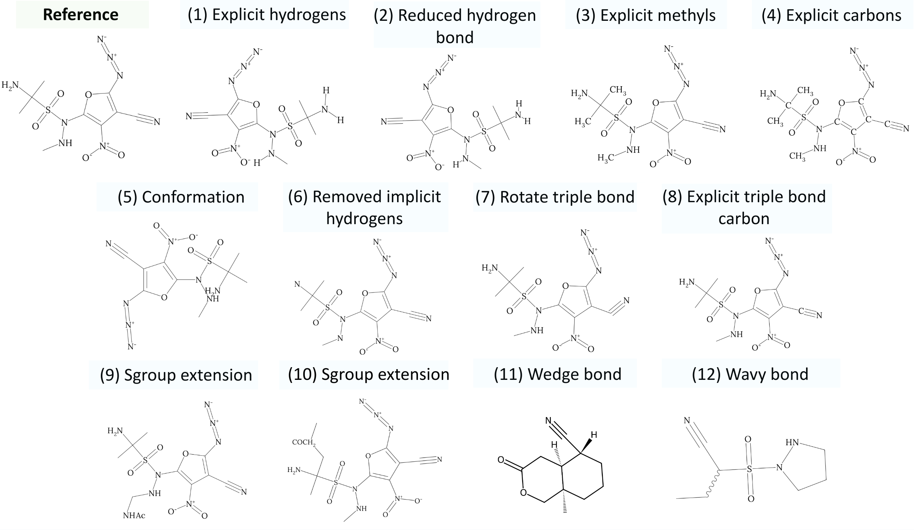
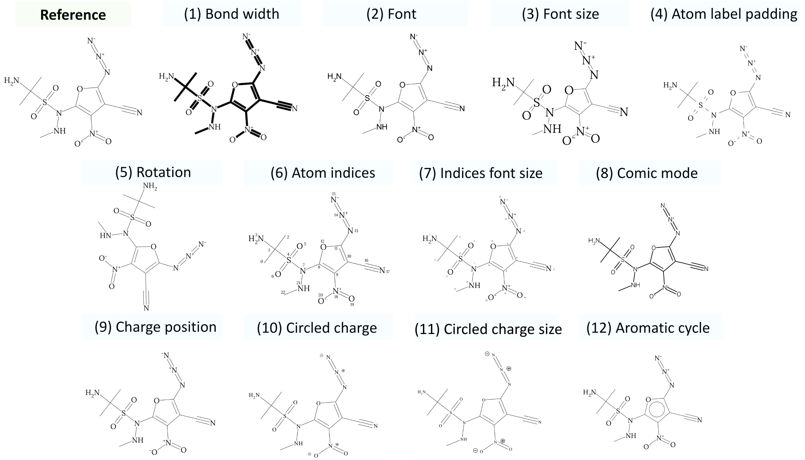

# MolDepictor

This is the repository for the synthetic data generation pipeline of [MolGrapher: Graph-based Visual Recognition of Chemical Structures](https://openaccess.thecvf.com/content/ICCV2023/html/Morin_MolGrapher_Graph-based_Visual_Recognition_of_Chemical_Structures_ICCV_2023_paper.html). 

### Citation

If you find this repository useful, please consider citing:
```
@InProceedings{Morin_2023_ICCV,
    author = {Morin, Lucas and Danelljan, Martin and Agea, Maria Isabel and Nassar, Ahmed and Weber, Valery and Meijer, Ingmar and Staar, Peter and Yu, Fisher},
    title = {MolGrapher: Graph-based Visual Recognition of Chemical Structures},
    booktitle = {Proceedings of the IEEE/CVF International Conference on Computer Vision (ICCV)},
    month = {October},
    year = {2023},
    pages = {19552-19561}
}
```

### Installation

Please refer to installation instructions of [MolGrapher](https://github.com/DS4SD/MolGrapher/).

### Example of molecule augmentations 



### Example of rendering augmentations 




